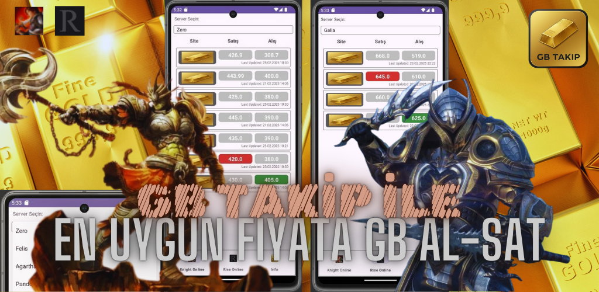
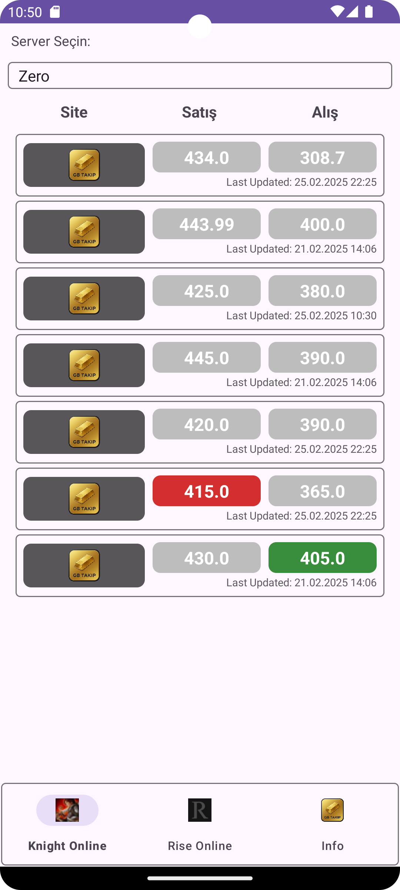
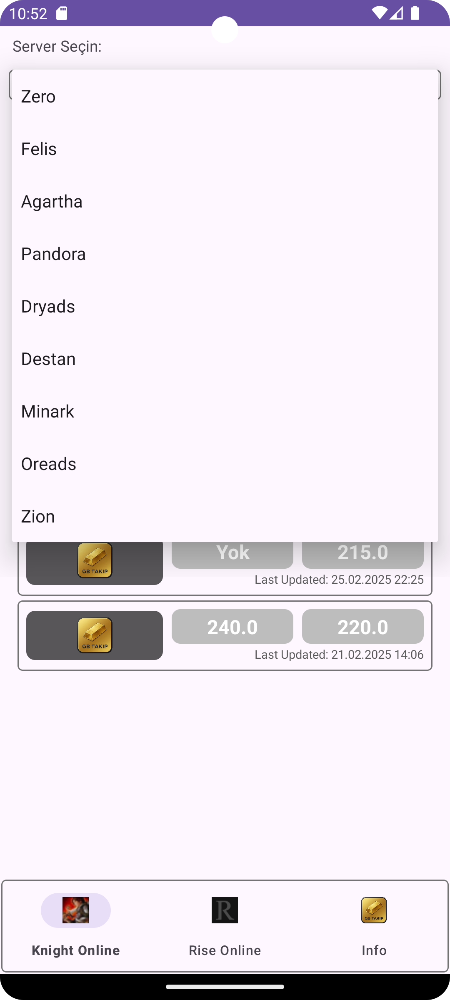
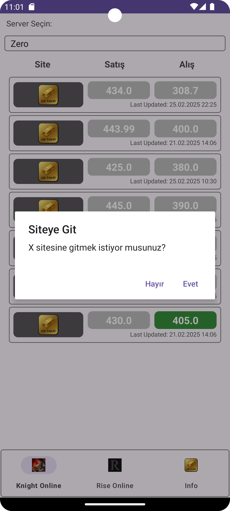
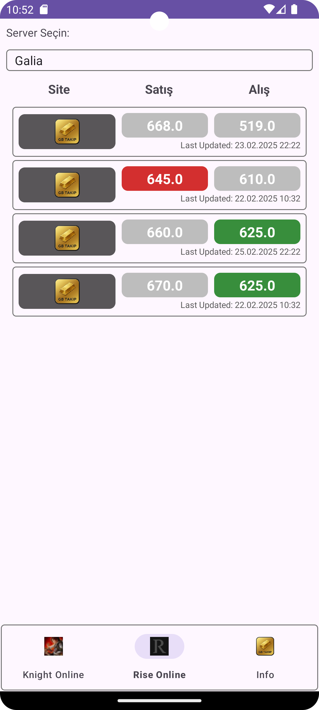
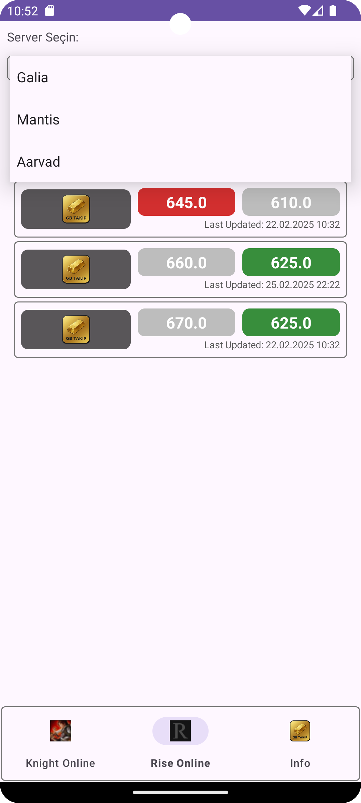
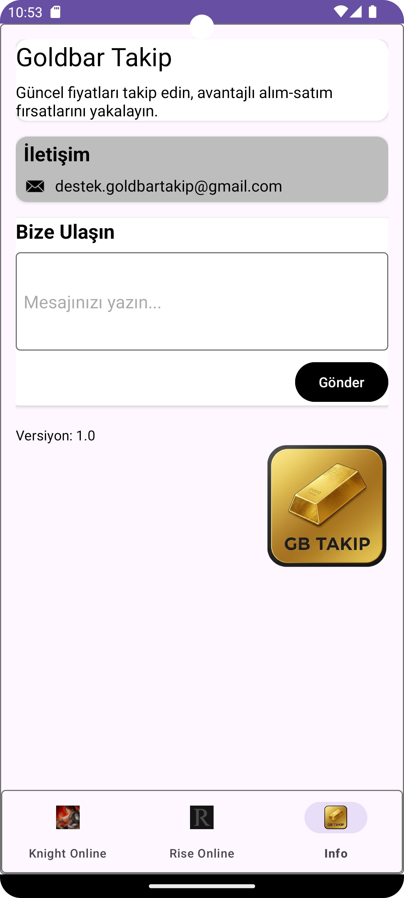

# GB Takip 📈🎮  
**Knight Online & Rise Online GB Fiyat Takip Uygulaması**  

## 📌 Açıklama  
**GB Takip**, **Knight Online** ve **Rise Online** oyunlarındaki çeşitli sitelerin **Gold Bar (GB) alış ve satış fiyatlarını** anlık olarak Firebase Firestore üzerinden çekerek karşılaştırmanıza olanak tanır. 
Firebase üzerindeki fiyatlar otomatik olarak Firebase fonksiyonu sayesinde belirli saatler içerisinde otomatik olarak güncellenir.

Uygulama, oyun içi ekonomik dalgalanmaları takip etmek ve oyuncuların en uygun fiyatları bulmasına yardımcı olmak için geliştirilmiştir.  

## 🚀 Özellikler  
✅ **Anlık Fiyat Güncellemeleri** – Sitelerden anlık olarak veri çekilir ve güncellenir.  
✅ **Fiyat Karşılaştırma** – Farklı sitelerin alış ve satış fiyatlarını görebilirsiniz.  
✅ **Minimal ve Kullanıcı Dostu Arayüz** – Temiz ve basit bir UI ile kolay kullanım sağlar.  
✅ **Knight Online & Rise Online Desteği** – Her iki oyun için de güncel fiyatları takip edebilirsiniz.  
✅ **Hızlı ve Güvenilir** – Firebase Firestore altyapısı ile hızlı ve güvenli veri sunar.  

## 🛠 Kullanılan Teknolojiler  

- **Kotlin** 
- **MVVM (Model-View-ViewModel)** 
- **Firebase Firestore** – Gerçek zamanlı veri depolama
- **Firebase Functions** – Gerçek zamanlı veri çekme
- **Firebase Crashlytics** – Hata izleme ve çökmeleri raporlama  
- **Google AdMob** – Uygulama açılışında reklam gösterimi  
- **Glide** – Resim yükleme ve önbellekleme için

## 📩 İletişim & Katkıda Bulunma
Herhangi bir geri bildirimde bulunmak veya projeye katkıda bulunmak isterseniz lütfen bana ulaşın.

📧 **İletişim: destek.goldbartakip@gmail.com**

## 📸 Ekran Görüntüleri  

     
     

